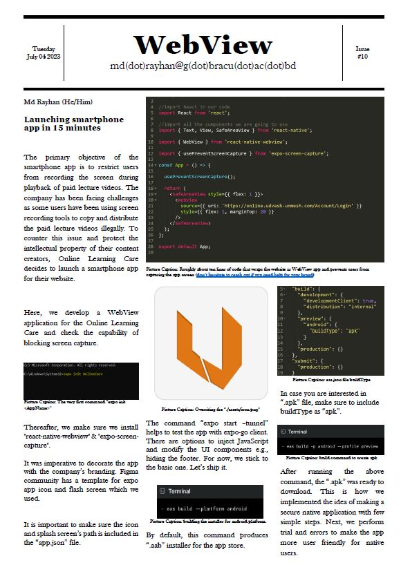

## OnlineCare

Introducing Our New Android App - **OnlineCare**!

Dear followers,

We are excited to announce the launch of our new Android app, OnlineCare! With OnlineCare, we have taken the OnlineCare Udvash-Unmesh(Largest tutor provider in Bangladesh) coaching center's website and transformed it into a native application for Android devices. This app aims to provide a more secure and seamless user experience by restricting _screen-capturing_ actions.

Our team recognized the need to deploy the website as a native application in order to enhance security measures and prevent unauthorized screen captures. With that in mind, we quickly developed OnlineCare, which wraps around the web application and provides a native app experience.

The development process was incredibly efficient, taking only a short span of time to implement. In just ten lines of code, we were able to create a solution that met our objectives. Our focus was on delivering a functional and secure application without sacrificing user experience.

As we move forward, our goal is to continuously improve and enhance OnlineCare. We are dedicated to making it more user-friendly and intuitive for our valued users. We appreciate your feedback and suggestions as we work towards building upon this basic application.

Thank you for your continued support and trust in our service. We hope you enjoy using OnlineCare and find it beneficial for your coaching center experience. Stay tuned for future updates and enhancements!

To learn more about OnlineCare, we invite you to check out our poster in the attached **ReadMe.pdf** file. It provides a visual representation of the app and its features.

### Best regards,

MD RAYHAN  
Requirement analyst and UX researcher
